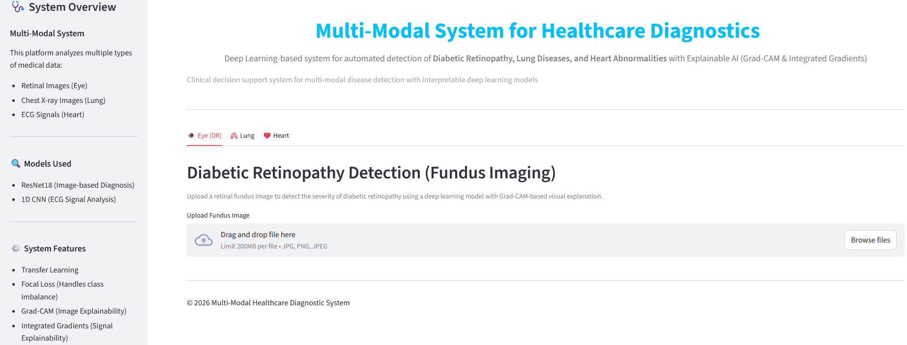
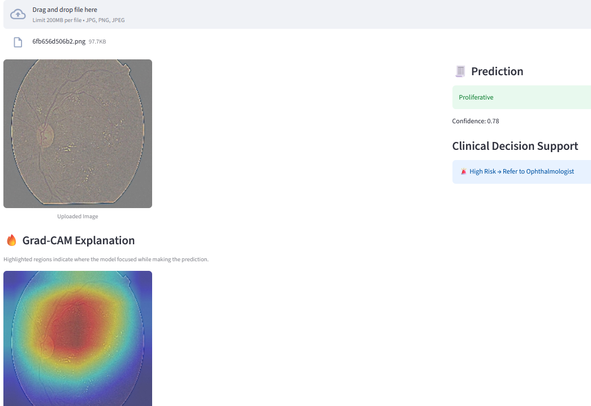
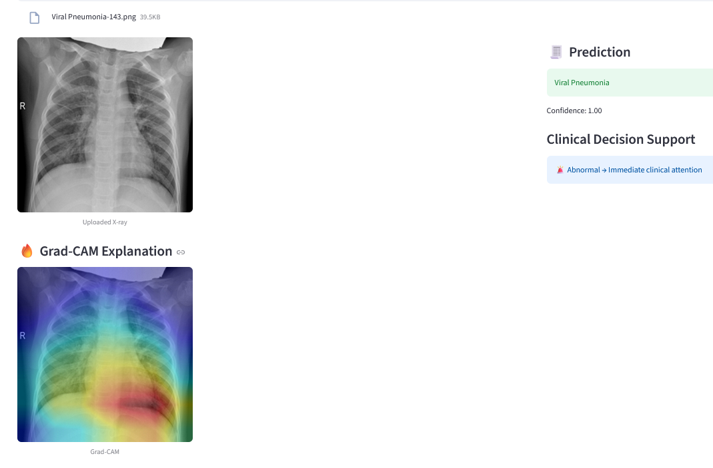
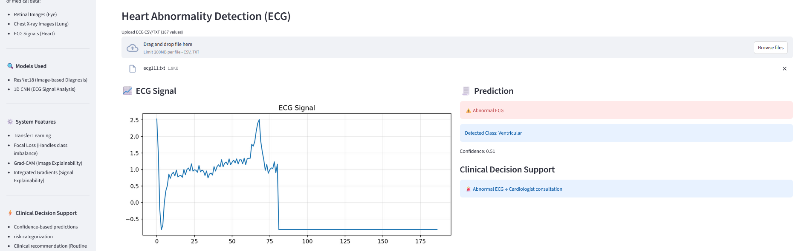
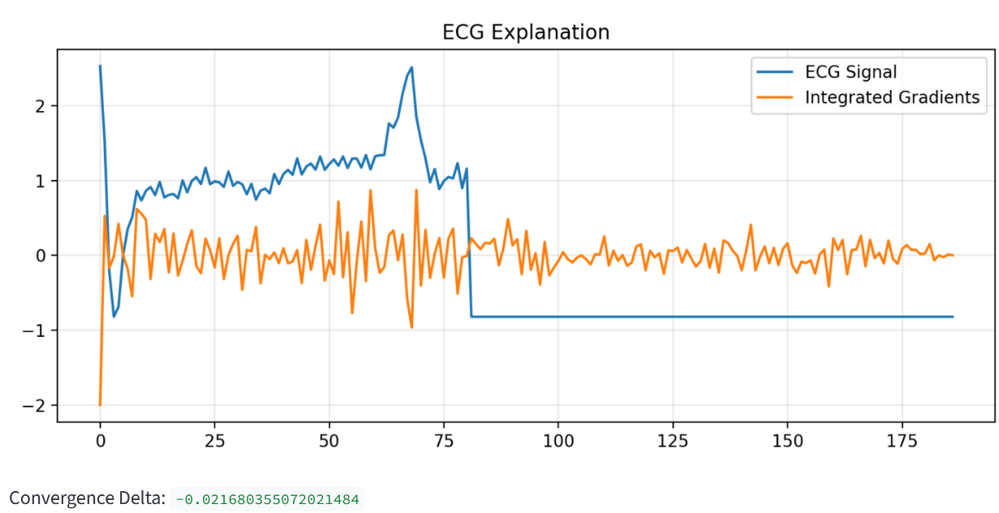

# Multi-Modal System for Healthcare Diagnostics

## Overview

The Multi-Modal System for Healthcare Diagnostics is a deep learning-based clinical decision support system designed to assist in the early detection of diseases using multiple healthcare data modalities.

The system integrates three diagnostic modules:

* Diabetic Retinopathy Detection using retinal fundus images
* Lung Abnormality Detection using chest X-ray images
* Heart Abnormality Detection using ECG signals

To improve reliability and interpretability, the system incorporates Explainable AI (XAI) techniques, confidence-based decision support, and visual explanations to assist clinical decision-making. All diagnostic modules are integrated into a unified Streamlit application that provides disease predictions, confidence scores, clinical decision support recommendations, and visual explanations.

## Application Screenshots

### Home Page

---

## Key Features

### Diabetic Retinopathy Detection

* Input: Retinal Fundus Images
* Model: ResNet18 (Transfer Learning)
* Classes:

  * No DR
  * Mild
  * Moderate
  * Severe
  * Proliferative DR
* Explainability: Grad-CAM
* Clinical Decision Support


---

### Lung Abnormality Detection

* Input: Chest X-ray Images
* Model: ResNet18 (Transfer Learning)
* Classes:

  * COVID
  * Lung Opacity
  * Normal
  * Viral Pneumonia
* Explainability: Grad-CAM
* Clinical Decision Support




---
### Heart Abnormality Detection

* Input: ECG Signals
* Model: 1D Convolutional Neural Network (1D CNN)
* Classes:

  * Normal
  * Supraventricular
  * Ventricular
  * Fusion
  * Unknown
* Explainability: Integrated Gradients
* Clinical Decision Support




### ECG Explainability (Integrated Gradients)


---

## Explainable AI

### Grad-CAM

Grad-CAM is used for image-based diagnostic models to highlight important regions in retinal and chest X-ray images that influence model predictions.

### Integrated Gradients

Integrated Gradients is used for ECG interpretation to identify signal segments that contribute most significantly to model decisions.

---

## Clinical Decision Support

The system combines model predictions with confidence-based decision logic to provide:

- Disease Prediction
- Confidence Score
- Risk Categorization
- Referral Recommendations
- Visual Explanations

---

## Models Used

| Module                         | Model    | Explainability       | Accuracy |
| ------------------------------ | -------- | -------------------- | -------- |
| Diabetic Retinopathy Detection | ResNet18 | Grad-CAM             | 75%      |
| Lung Abnormality Detection     | ResNet18 | Grad-CAM             | 84%      |
| Heart Abnormality Detection    | 1D CNN   | Integrated Gradients | 97%      |


---

## Technologies Used

* Python
* PyTorch
* TorchVision
* Streamlit
* Captum
* OpenCV
* NumPy
* Pandas
* Scikit-Learn
* Matplotlib
* Seaborn

---

## Datasets

### Diabetic Retinopathy
Diabetic Retinopathy 224x224 Gaussian Filtered Dataset

https://www.kaggle.com/datasets/sovitrath/diabetic-retinopathy-224x224-gaussian-filtered

### Lung Abnormality Detection
COVID-19 Radiography Database

https://www.kaggle.com/datasets/tawsifurrahman/covid19-radiography-database

### Heart Abnormality Detection
ECG Heartbeat Categorization Dataset

https://www.kaggle.com/datasets/shayanfazeli/heartbeat

Download the datasets from their respective sources and place them in the appropriate data directories before training the models.

---

## Running the Application

### Install Dependencies

```bash
pip install -r requirements.txt
```
### Required Model Files

Ensure the trained model (.pth) files are available in the project directory before running the application.

### Launch Streamlit Application

```bash
streamlit run app.py
```

---

## Disclaimer

This project is intended for educational and research purposes only. It is not a substitute for professional medical diagnosis, treatment, or clinical decision-making.

---

## Author

**Farheen Rabbani Shaik**

AI/ML Project – Multi-Modal System for Healthcare Diagnostics
